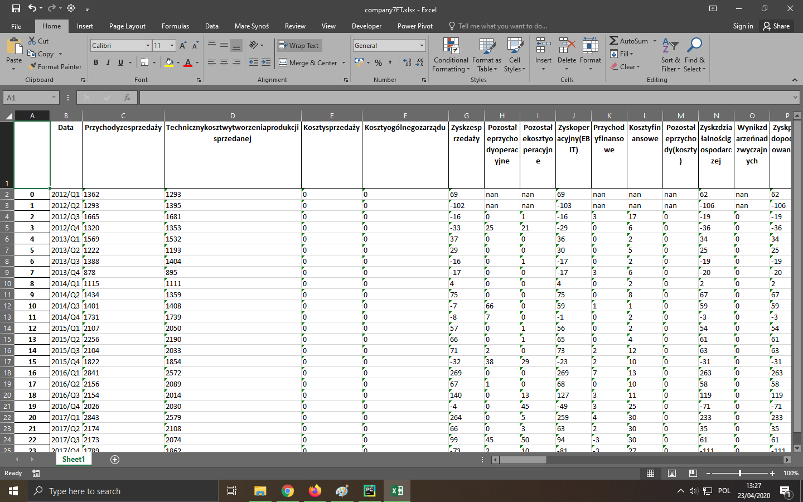
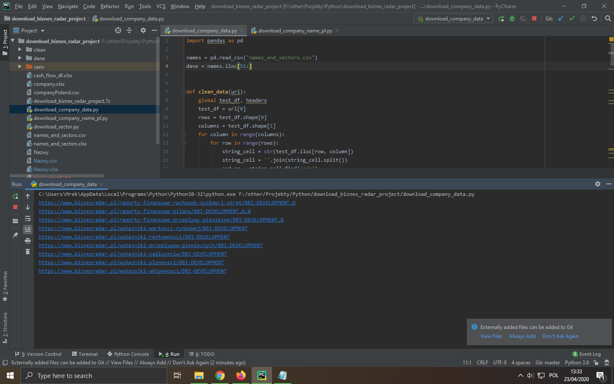

# download-biznes-radar-project
Scrape all financial data from GPW.

Simple script to download financial documents with ratios for every companies on polish stock market. I worked on Pandas, urllib and beautifulsoup library. I scrapped from html file. The main task was download every data and save in csv or xls format. The main reason was that I will use this data for predict ratios.

